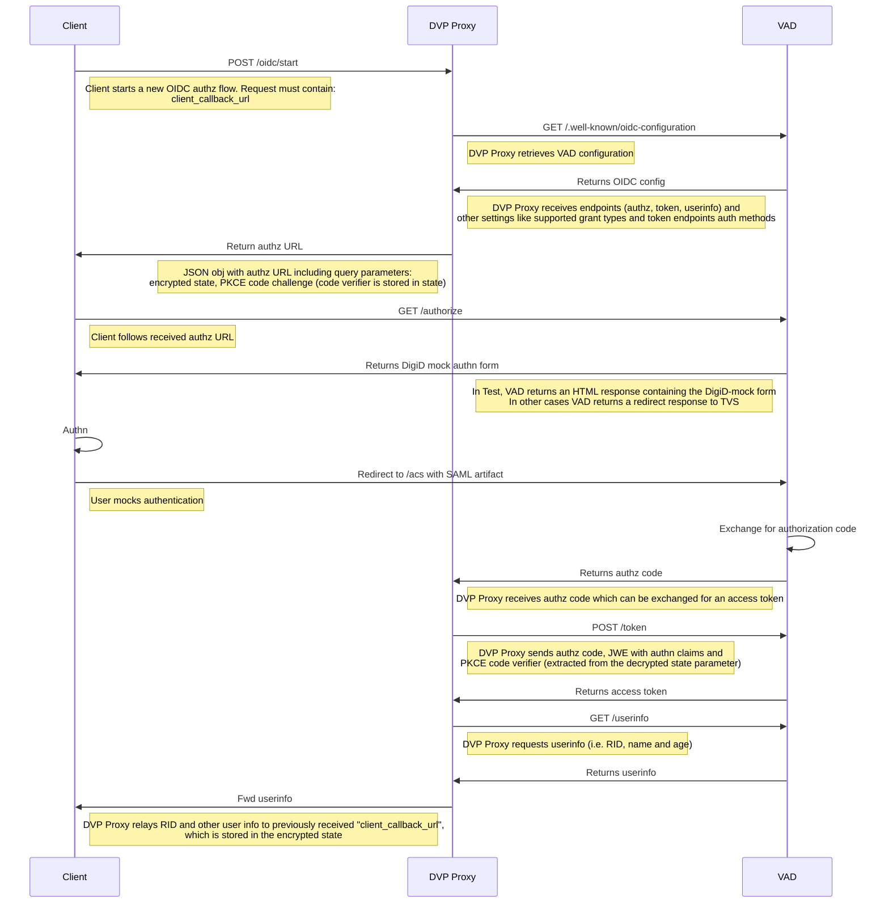

```mermaid
sequenceDiagram
    participant Client
    participant DVP Proxy
    participant VAD


    Client->>DVP Proxy: POST /oidc/start
    note right of Client: Client starts a new OIDC authz flow. Request must contain:<br/>client_callback_url
    DVP Proxy->>VAD: GET /.well-known/oidc-configuration
    note right of DVP Proxy: DVP Proxy retrieves VAD configuration
    VAD->>DVP Proxy: Returns OIDC config
    note right of DVP Proxy: DVP Proxy receives endpoints (authz, token, userinfo) and<br>other settings like supported grant types and token endpoints auth methods
    DVP Proxy->>Client: Return authz URL
    note left of DVP Proxy: JSON obj with authz URL including query parameters:<br/>encrypted state, PKCE code challenge (code verifier is stored in state)
    Client->>VAD: GET /authorize
    note right of Client:  Client follows received authz URL
    VAD->>Client: Returns DigiD mock authn form
    note left of VAD: In Test, VAD returns an HTML response containing the DigiD-mock form<br>In other cases VAD returns a redirect response to TVS
    Client->>Client: Authn
    Client->>VAD: Redirect to /acs with SAML artifact
    note right of Client:  User mocks authentication
    VAD->>VAD: Exchange for authorization code
    VAD->>DVP Proxy: Returns authz code
    note right of DVP Proxy: DVP Proxy receives authz code which can be exchanged for an access token
    DVP Proxy->>VAD: POST /token
    note right of DVP Proxy: DVP Proxy sends authz code, JWE with authn claims and<br>PKCE code verifier (extracted from the decrypted state parameter)
    VAD->>DVP Proxy: Returns access token

    DVP Proxy->>VAD: GET /userinfo
    note right of DVP Proxy: DVP Proxy requests userinfo (i.e. RID, name and age)
    VAD->>DVP Proxy: Returns userinfo
    DVP Proxy->>Client: Fwd userinfo
    note left of DVP Proxy: DVP Proxy relays RID and other user info to previously received "client_callback_url",<br/>which is stored in the encrypted state
```
